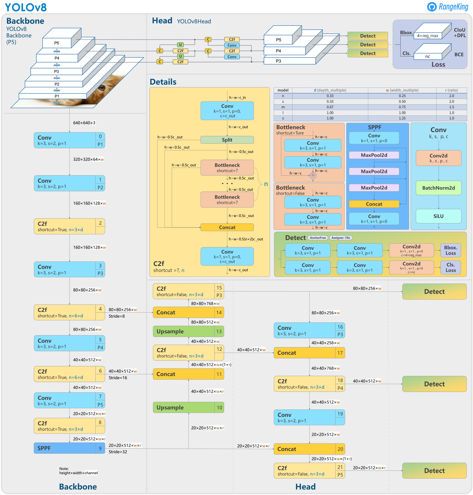
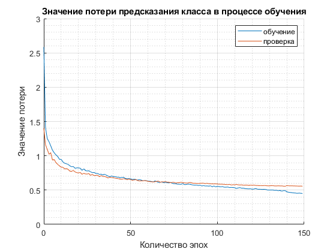
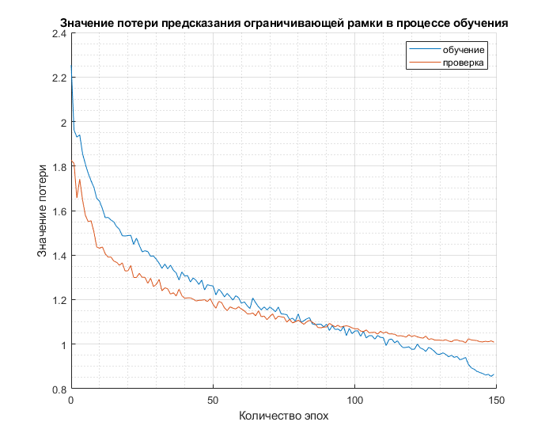
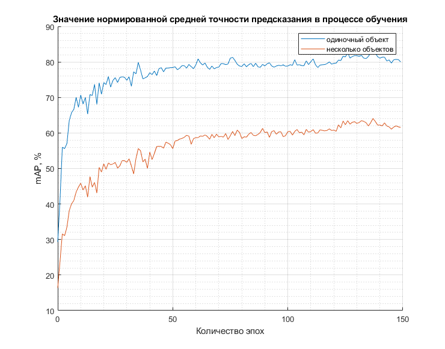
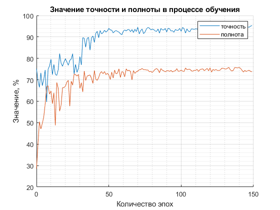
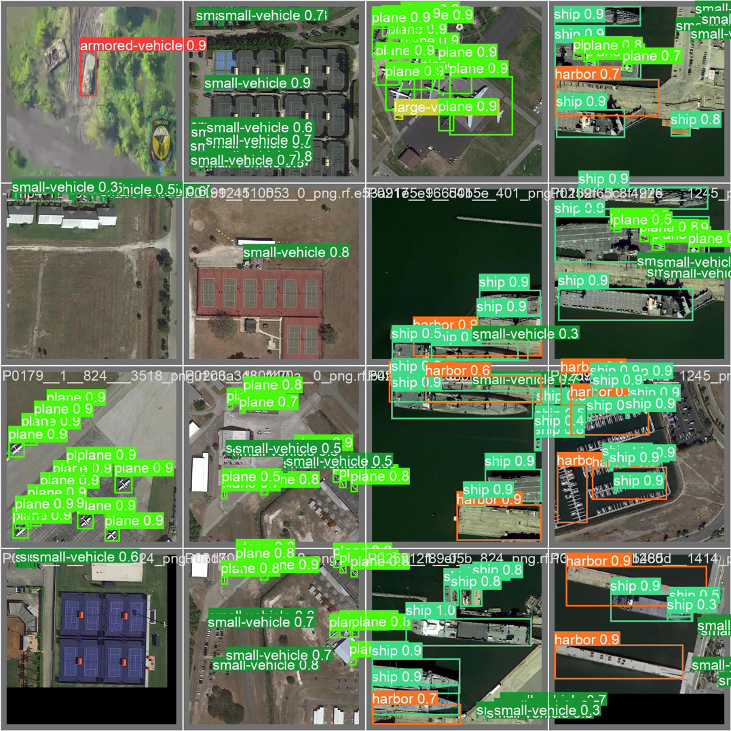

# Система распознавания изображений

<div style="text-align: justify">Это репозиторий модели, спроектированной и реализованной в ходе исследования для научной работы 6-го семестра, 2023 год.</div>

##### В репозитории вы найдете:
- Архитектуру сети
- Преобразование набора данных
- Процесс обучения
- Результаты эксперимента

## 1. Архитектура сети

<div style="text-align: justify">Экспериментальная модель была собрана на основе готовой архитектуры сверточной нейронной сети — <b>YOLO</b> (<em>You Only Look Once</em>) восьмой версии (YOLOv8).</div>

<br>

Найти репозиторий данной архитектуры можно [здесь](https://github.com/ultralytics/ultralytics).

<div style="text-align: justify">Архитектуру YOLOv8 можно изобразить с помощью следующей блок-схемы (<a href="https://github.com/ultralytics/ultralytics/issues/189">источник</a>):</div>



<div style="text-align: justify">Подобное устройство архитектуры позволяет эффективно пользоваться ресурсами ЭВМ (а именно оперативной памятью и видеопамятью графического ядра), что несомненно влияет на производительность итоговой модели. Более того, от такой оптимизации не страдает качество, следовательно, модель способна с высокой точностью распознавать объекты с аэрофотоснимков.</div>

<br>

<div style="text-align: justify">Таким образом, YOLOv8 превосходит по точности и производительности все предыдущие модели своего семейства. Сравнения были выполнены на наборе данных <a href="https://cocodataset.org/">COCO</a>:</div>


<div style="text-align: justify">Архитектура YOLOv8 поставляется совместно с пятью моделями, каждая из которых имеет разные параметры и наименования:</div>

|  Модель | Размер (пикселей) | Средняя точность | Скорость (мс) | Число параметров (млн) |
|:-------:|:-------------------:|:---------------------------------:|:--------------------------:|:------------------------------:|
| YOLOv8n |         640         |                37.3               |            80.4            |               3.2              |
| YOLOv8s |         640         |                44.9               |            128.4           |              11.2              |
| YOLOv8m |         640         |                50.2               |            234.7           |              25.9              |
| YOLOv8l |         640         |                52.9               |            375.2           |              43.7              |
| YOLOv8x |         640         |                53.9               |            479.1           |              68.2              |

В данной научной работе была выбрана модель на основе **YOLOv8s**.

## 2. Преобразование набора данных

<div style="text-align: justify">Изначально все модели на архитектуре YOLO (в том числе YOLOv8) имеют следующую разметку:</div>

<br>

##### img001.txt
```txt
1 0.617 0.3594420600858369 0.114 0.17381974248927037
1 0.094 0.38626609442060084 0.156 0.23605150214592274
1 0.295 0.3959227467811159 0.13 0.19527896995708155
```
Тут первое число — это порядковый номер класса в словаре `names` в файле конфигурации `data.yaml`. Второе и третье числа — координаты центра ограничивающей рамки по `x` и `y` соответственно. Четвертое и пятое числа — ширина и высота ограничивающей рамки соответственно.

<br>

###### data.yaml
```yaml
train: ../train/images
val: ../valid/images

nc: 10
names: ['small-vehicle', 'large-vehicle', 'plane', 'storage-tank', 'ship', 'harbor', 'roundabout', 'bridge', 'helicopter', 'container-crane']
```

<div style="text-align: justify">Таким образом, исходный набор данных DOTA необходимо преобразовать, так как его формат отличается от входного формата архитектуры YOLO.</div>

<br>

#### Копируем репозиторий
```bash
git clone https://github.com/ComradeMashkov/UAV_objects_detection.git
cd UAV_objects_detection
``` 

#### Загружаем набор DOTA
Набор данных DOTA можно скачать [здесь](https://captain-whu.github.io/DOTA/dataset.html).
Затем его надо распаковать следующим образом:
```
DOTA-yolov8
|
├─dataset
│  ├─train
│  │  ├─images
│  │  └─labelTxt
│  └─val
│      ├─images
│      └─labelTxt
```

#### Зависимости
- python3
- opencv-python
- shapely (включая geos)

#### Разделяем набор данных
```bash
python data_transform/split.py
```
Подробнее об этом можно посмотреть [здесь](https://github.com/CAPTAIN-WHU/DOTA_devkit).

#### Преобразуем аннотоации
```bash
mkdir dataset/trainsplit/labels
mkdir dataset/valsplit/labels
python data_transform/YOLO_Transform.py
```

<div style="text-align: justify">Таким образом, исходный набор данных был преобразован к формату YOLO. Также, в новый набор данных был добавлен новый класс — armored-vehicle и удалены некоторые классы за ненадобностью.</div>

<br>

Готовый набор данных можно скачать [здесь](https://app.roboflow.com/ds/uxW2MUr7Zo?key=Y2v8yNDBMi).

## Процесс обучения

Процесс обучения описан в ноутбуке ```train.ipynb```.

<div style="text-align: justify">Обучение проводилось на графическом ядре NVIDIA Tesla T4 с 16 гигабайтами видеопамяти и со встроенными 12 гигабайтами оперативной памяти. Время обучения — 6 часов.</div>

## Результаты эксперимента

<div style="text-align: justify">Ниже приведены основные метрики, полученные по окончанию эксперимента обучения системы.</div>

<br>

- Значение функции потерь для класса:



- Значение функции потерь для ограничивающей рамки:



- Значения mAP (50, 50-95):



- Значения точности и полноты:



Со всеми значениями можно ознакомиться в файле ```results.csv```. 

Графики зависимостей были построены с использованием **MATLAB_R2022a**.

## Результат применения модели на мини-выборке 4 х 4


